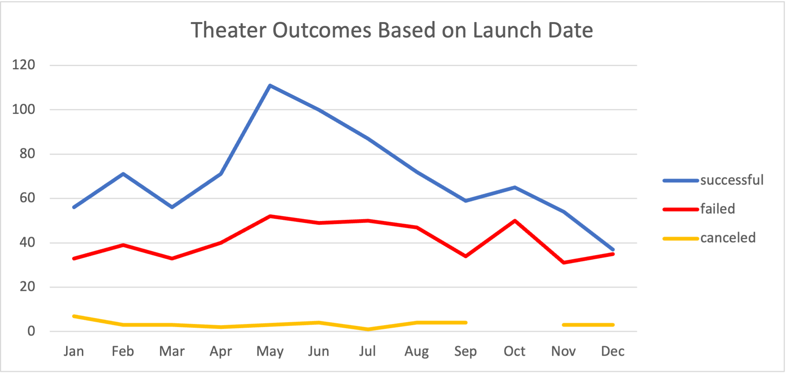
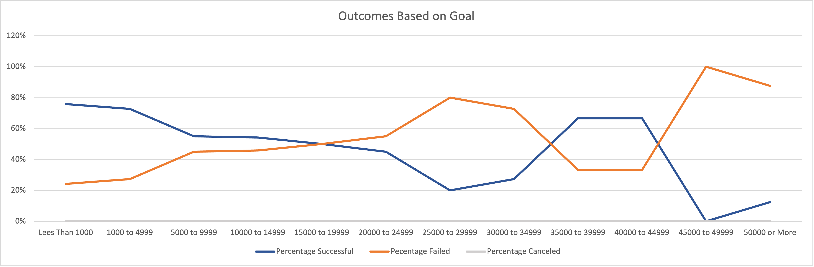

# Analysis of Kickstarting Plays

## Overview of Project
Using excel to extract data to create charts for Louise so that she can see the results of each campaign. The purpose of this was to view the outcomes of plays by launch date and goals. By using the data from 2009 to 2017 to trend the outcomes from launch month and from pledged goals. 

## Analysis and Challenges
I had to add another column in the “Kickstarter” workbook that calculated the Year from the Unix time stamp in column S. Created a pivot table and filtering on theater for all the years and placing the correct data in the Rows so that data can be viewed using a line chart that contains successful, failed and cancelled projects. Then creating another chart using data that only included plays and the goal amount. The challenge was to ensure that I was only capturing the required data for each cell.

### Analysis of Outcomes Based on Launch Date
Theater tends to be most successful if the project is launched in the summer months of May, June and July. As you can see from this chart that data shows May as having the most successful outcomes.

### Analysis of Outcomes Based on Goals
The most successful goals come from pledging less than $1,000 and no more than $4,999. The data would suggest that to be successful you will need to keep the budgeted goal below $5,000.

### Challenges and Difficulties Encountered
The biggest challenge I encountered was not inputting the correct parameters for the COUNTIFS formula on the "Outcomes Based on Goals" sheet. At first, I was on the wrong column using the “pledged” when I should have used the “goal” column. Then I didn’t include “plays” in the formula, so my numbers were too high.   

## Results

- The month of May has the most theater projects that are the most successful and with the highest number of projects compared to other months. The least successful month is December with as much successful projects as failed projects. 

- The most successful goal was less than $1000, so it seems that projects that tend to be cost less are the most successful. The highest percentage failure points to any amount above $25000.

- The data that was collected could have been more specific or using the most current data would be more informative. 

- A bar chart like the [Outcomes Based on Goal](https://github.com/princetonduarte/kickstarter-analysis/blob/b211a2625b40c87e651b23da4d9f55ab1b94fcbb/Outcomes_vs_Goals_column.png) could have been used and presented the information easier to read.
